# workshop-Multivariate-analysis
# AIM:
To perform multivarient analysis on the given data set.

# ALGORITHM:
### 1.Clean the data
### 2.Remove outliers
### 3.Apply the skew function and Kurtosis
### 4.Apply Bivariate analysis on numerical and categorical
### 5.Apply Multivariate analysis.
# CODE:
## BIVARIATE ANALYSIS:
``` python
import pandas as pd
import numpy as np
import seaborn as sns
import matplotlib.pyplot as plt
df=pd.read_excel("/content/FlightInformation.xlsx")
df.info()
df.isnull().sum()
df['Route']=df['Route'].fillna(df['Route'].mode()[0])
df['Total_Stops']=df['Total_Stops'].fillna(df['Total_Stops'].mode()[0])
df.isnull().sum()
sns.scatterplot(x="Duration",y="Price",data=df)
sns.scatterplot(x="Airline",y="Price",data=df)
plt.figure(figsize=(115,15))
sns.boxplot(x="Source",y="Price",data=df)
sns.displot(df,x="Source",hue="Destination")
sns.barplot(x=df['Price'],y=df['Source'],data=df)
```
## MULTIVARIATE ANALYSIS:
```python
pa=pa.groupby(by=["Duration"]).sum().sort_values(by="Price")
plt.figure(figsize=(75,20))
sns.barplot(x=pa.index,y="Price",data=pa)
plt.xticks(rotation = 90)
plt.xlabel=("Duration")
plt.ylabel=("Price")
plt.show()
bas=df.loc[:,["Airline","Price"]]
bas=bas.groupby(by=["Airline"]).max().sort_values(by="Price")
plt.figure(figsize=(17,7))
sns.barplot(x=bas.index,y="Price",data=bas)
plt.xticks(rotation = 90)
plt.xlabel=("AIRLINE")
plt.ylabel=("PRICE")
plt.show()
c=df.loc[:,["Airline","Price"]]
c=c.groupby(by=["Airline"]).min().sort_values(by="Price")
plt.figure(figsize=(17,7))
sns.barplot(x=c.index,y="Price",data=c)
plt.xticks(rotation = 90)
plt.xlabel=("AIRLINE")
plt.ylabel=("PRICE")
plt.show() 
```
# OUTPUT 
## bivariant
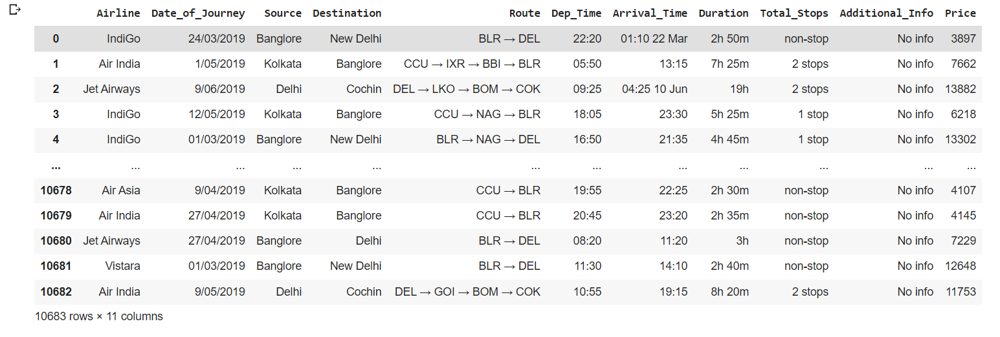
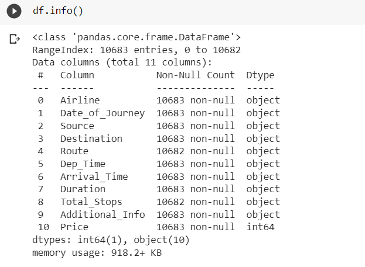
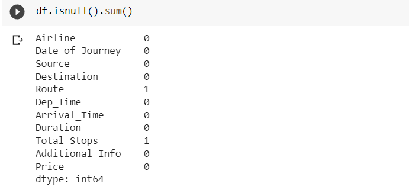
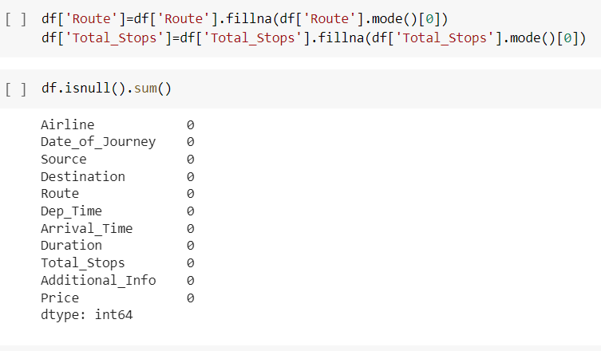
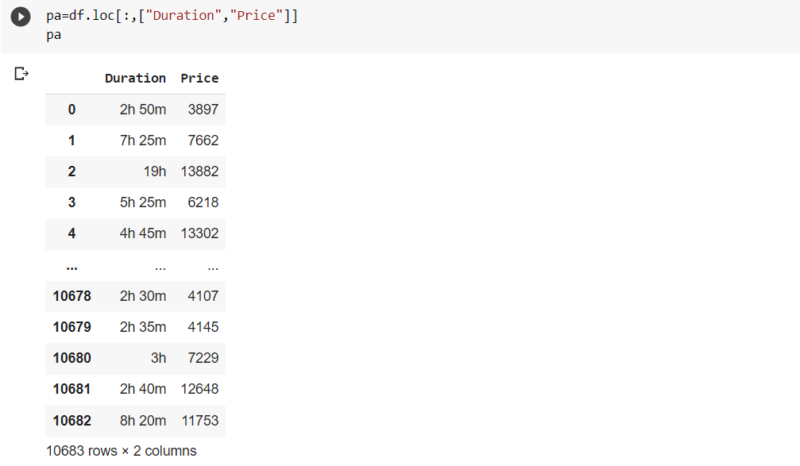
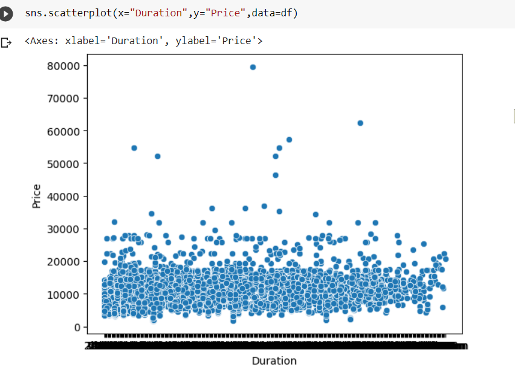
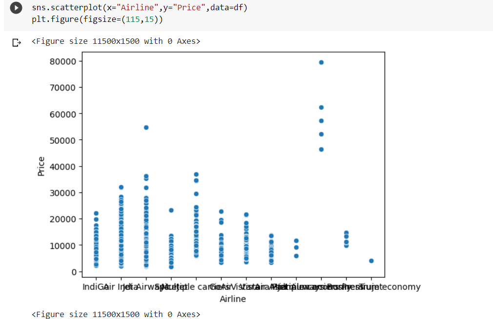
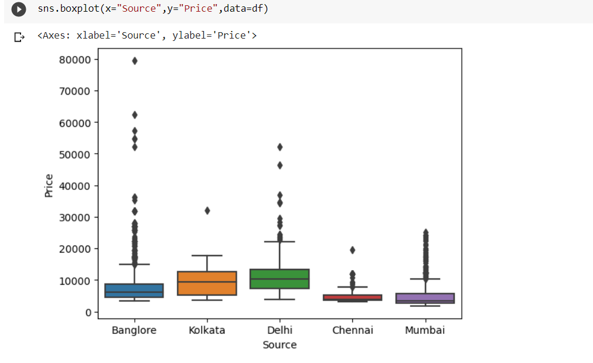
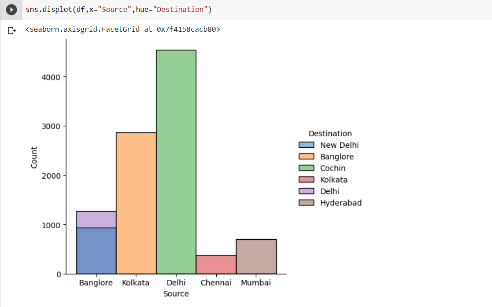
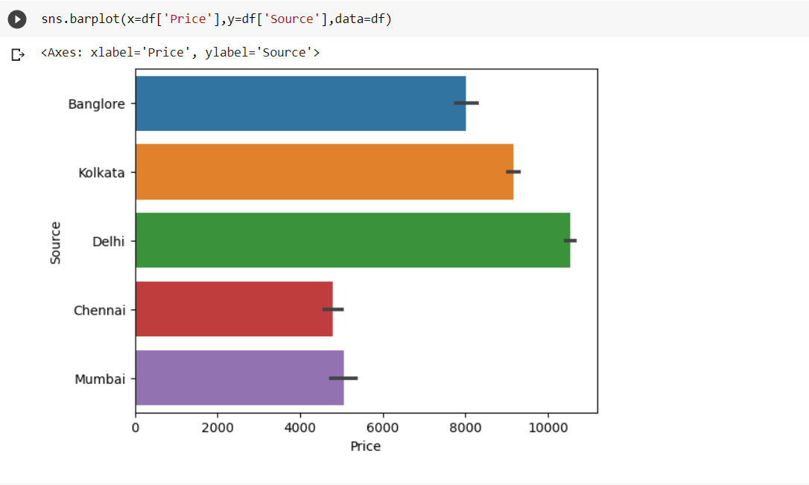
## multivariant
### MEAN
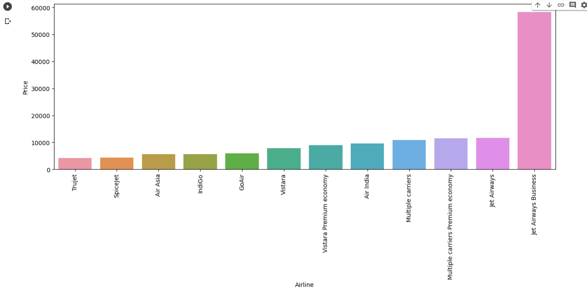
### MAX
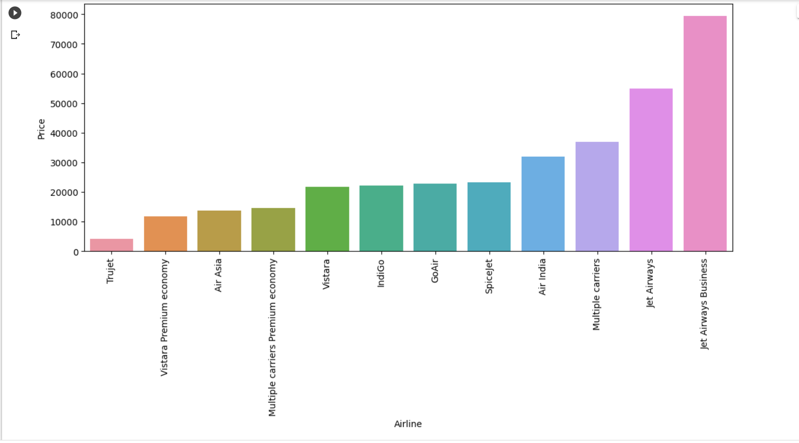
### SUM
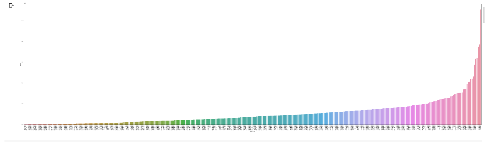
### MIN
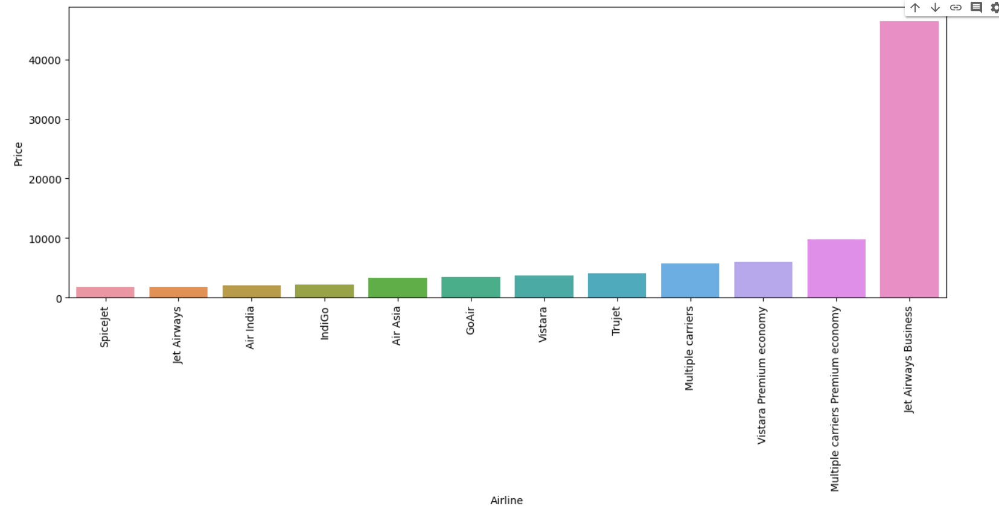
### HEATMAP
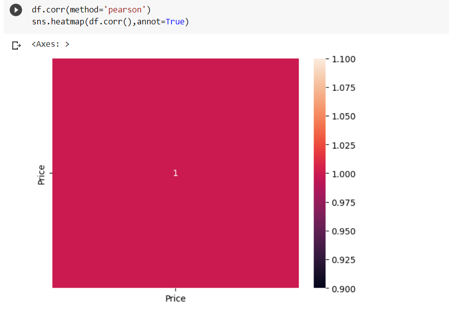
